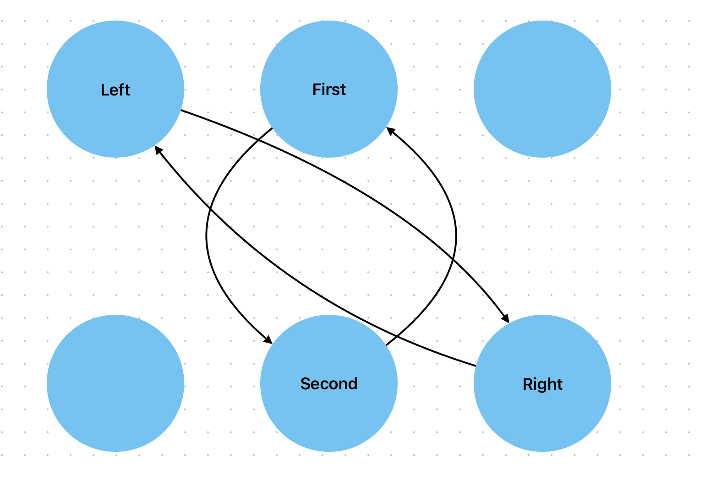

Источник: https://neerc.ifmo.ru/wiki/index.php?title=Фибоначчиева_куча
- содержит довольно много неточностей, например, функция decrease_key:
- если структура дерева не сохраняется, то новый ключ никогда не будет применен
# Добавление элемента:
Новый элемент добавляется в корневой список правее минимального и при необходимости обновляется указатель на минимум.

# Объединение двух списков

# Удаление минимального элемента
1. Меняем указатели соседних элементов(левого и правого)
2. Запускаем процедуру прореживания деревьев

# consolidate - прореживание деревьев
Основная идея заключается в том, чтобы в списке корней были деревья разной степени